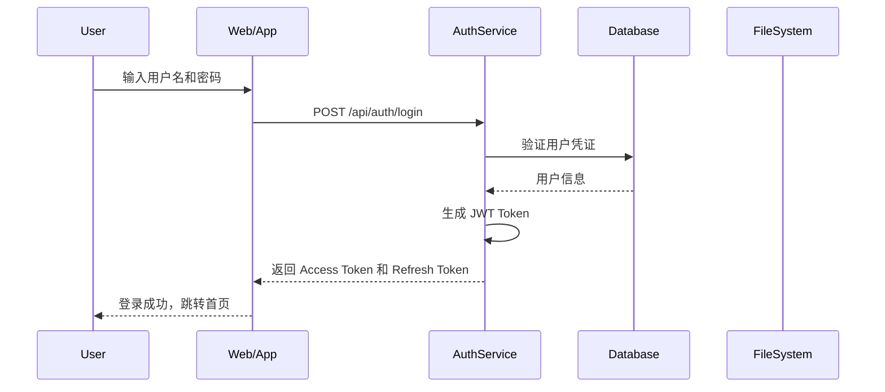

# 源码安全审计系统 - 详细设计文档

**项目名称**: Source Code Security Audit System (SCSAS)  
**版本**: v1.0.0  
**编写日期**: 2026-05-14  
**状态**: 设计中

---

## 1. 项目概述

### 1.1 项目背景

公司源码部署在虚拟机上（Windows 或 Linux），存在以下安全风险：
- 源码访问缺乏统一认证机制
- 无法追踪用户对源码的操作行为
- 重要文件的修改和删除操作缺乏审计
- 缺乏细粒度的权限控制

### 1.2 项目目标

1. **认证管理**: 所有用户必须登录才能访问源码
2. **操作审计**: 完整记录用户对源码的所有操作（读取、编辑、删除、下载）
3. **权限控制**: 基于用户角色的细粒度权限管理
4. **可视化**: 提供 Web 界面和 CLI 工具，支持审计日志查询和分析
5. **跨平台**: 支持 Windows 和 Linux 虚拟机部署

### 1.3 项目范围

**包含内容**:
- 用户认证系统（本地密码 + SSH 密钥）
- 文件系统监控模块
- 审计日志系统
- Web 管理界面
- CLI 命令行工具
- RESTful API 接口

**不包含内容**:
- 源码版本控制系统（集成 Git/SVN）
- 持续集成/持续部署功能
- 性能监控系统

---

## 2. 系统架构

### 2.1 整体架构

```
┌────────────────────────────────────────────────────────────────┐
│                        用户层                                  │
│  ┌──────────────────┐          ┌─────────────────────────────┐  │
│  │   Web 界面        │          │    CLI 命令行工具           │  │
│  │   (Vue.js 3)     │          │    (Python Click)           │  │
│  │   Element Plus   │          │                             │  │
│  └────────┬─────────┘          └────────────┬────────────────┘  │
└───────────┼──────────────────────────────────┼─────────────────┘
            │                                  │
            └──────────────┬───────────────────┘
                           │
┌───────────────────────────▼────────────────────────────────────┐
│                      API 网关层                                 │
│                    (FastAPI + Uvicorn)                         │
│  ┌─────────────────┐  ┌─────────────────┐  ┌─────────────────┐  │
│  │   JWT 中间件     │  │   CORS 中间件    │  │  限流中间件      │  │
│  │   认证中间件     │  │                 │  │                 │  │
│  └─────────────────┘  └─────────────────┘  └─────────────────┘  │
└───────────────────────────┬────────────────────────────────────┘
                            │
┌───────────────────────────▼────────────────────────────────────┐
│                      核心服务层                                 │
│  ┌────────────────┐  ┌────────────────┐  ┌────────────────────┐ │
│  │    认证服务     │  │    审计服务     │  │    文件服务        │ │
│  │   AuthService  │  │  AuditService  │  │   FileService     │ │
│  └────────────────┘  └────────────────┘  └────────────────────┘ │
│  ┌────────────────┐  ┌────────────────┐  ┌────────────────────┐ │
│  │    用户服务     │  │    权限服务     │  │    监控服务        │ │
│  │  UserService   │  │PermissionServ │  │MonitorService     │ │
│  └────────────────┘  └────────────────┘  └────────────────────┘ │
└───────────────────────────┬────────────────────────────────────┘
                            │
┌───────────────────────────▼────────────────────────────────────┐
│                      数据存储层                                  │
│  ┌────────────────────────┐  ┌──────────────────────────────┐  │
│  │   SQLite/PostgreSQL    │  │     文件系统                  │  │
│  │   用户数据、审计日志    │  │     审计日志文件              │  │
│  │   配置信息              │  │     /var/log/audit/          │  │
│  └────────────────────────┘  └──────────────────────────────┘  │
└─────────────────────────────────────────────────────────────────┘
```

### 2.2 技术栈

| 层级 | 技术选型 | 说明 |
|------|----------|------|
| 后端框架 | FastAPI | 高性能异步 API 框架 |
| 数据库 | SQLite (开发) / PostgreSQL (生产) | 审计日志和用户数据存储 |
| Web 框架 | Vue.js 3 + Element Plus | 现代化响应式界面 |
| CLI 框架 | Click | Python 命令行应用 |
| 文件监控 | watchdog | 跨平台文件系统监控 |
| 认证 | PyJWT + bcrypt | JWT Token + 密码加密 |
| 日志 | Python logging + JSON | 结构化日志记录 |
| ASGI 服务器 | Uvicorn | 高性能 ASGI 服务器 |

### 2.3 目录结构

```
/workspace/
├── backend/                          # 后端代码
│   ├── app/
│   │   ├── __init__.py
│   │   ├── main.py                  # FastAPI 应用入口
│   │   ├── config.py                # 配置管理
│   │   ├── database.py              # 数据库连接
│   │   ├── models/                  # 数据模型
│   │   │   ├── __init__.py
│   │   │   ├── user.py
│   │   │   ├── audit_log.py
│   │   │   └── permission.py
│   │   ├── schemas/                 # Pydantic 模型
│   │   │   ├── __init__.py
│   │   │   ├── user.py
│   │   │   ├── audit.py
│   │   │   └── auth.py
│   │   ├── routers/                 # API 路由
│   │   │   ├── __init__.py
│   │   │   ├── auth.py
│   │   │   ├── files.py
│   │   │   ├── audit.py
│   │   │   └── users.py
│   │   ├── services/                # 业务逻辑
│   │   │   ├── __init__.py
│   │   │   ├── auth_service.py
│   │   │   ├── user_service.py
│   │   │   ├── audit_service.py
│   │   │   ├── file_service.py
│   │   │   └── monitor_service.py
│   │   ├── middleware/              # 中间件
│   │   │   ├── __init__.py
│   │   │   ├── auth.py
│   │   │   └── logging.py
│   │   └── utils/                   # 工具函数
│   │       ├── __init__.py
│   │       ├── security.py
│   │       └── file_utils.py
│   ├── requirements.txt
│   └── run.py                       # 启动脚本
├── frontend/                        # 前端代码
│   ├── src/
│   │   ├── App.vue
│   │   ├── main.js
│   │   ├── router/
│   │   ├── views/                   # 页面组件
│   │   ├── components/              # 通用组件
│   │   ├── stores/                  # 状态管理
│   │   ├── api/                     # API 调用
│   │   └── assets/
│   ├── package.json
│   └── vite.config.js
├── cli/                             # CLI 工具
│   ├── audit_cli/
│   │   ├── __init__.py
│   │   ├── cli.py
│   │   ├── commands/
│   │   └── utils/
│   └── setup.py
├── docs/                            # 文档
│   ├── specs/
│   └── api/
├── config/                          # 配置文件
│   ├── config.yaml
│   └── logging.yaml
├── logs/                           # 日志目录
│   └── audit/
├── tests/                          # 测试代码
│   ├── backend/
│   ├── frontend/
│   └── cli/
├── docker/                         # Docker 部署
│   ├── Dockerfile
│   └── docker-compose.yml
└── README.md
```

---

## 3. 功能模块详细设计

### 3.1 认证系统

#### 3.1.1 用户认证

**功能描述**: 
提供安全的用户认证机制，支持多种认证方式。

**支持的认证方式**:

1. **用户名/密码认证**
   - 使用 bcrypt 算法加密存储密码
   - 密码强度要求：至少 8 位，包含大小写字母和数字
   - 登录失败锁定：连续 5 次失败后锁定 15 分钟
   - 支持"记住我"功能（延长 Token 有效期）

2. **SSH 公钥认证**
   - 用户可上传 SSH 公钥
   - 支持 RSA、ED25519、ECDSA 类型的公钥
   - 用于 CLI 工具的身份验证

3. **JWT Token 认证**
   - Access Token：短期有效（默认 30 分钟）
   - Refresh Token：长期有效（默认 7 天）
   - Token 包含用户 ID、角色、过期时间
   - Token 黑名单机制（支持强制登出）

**认证流程**:



#### 3.1.2 用户管理

**用户角色**:

1. **系统管理员 (admin)**
   - 管理所有用户（创建、修改、删除）
   - 分配用户权限
   - 查看所有审计日志
   - 系统配置管理

2. **普通用户 (user)**
   - 修改个人信息
   - 管理自己的 SSH 公钥
   - 访问授权的源码目录
   - 查看自己的审计日志

**用户生命周期**:

1. **注册**: 用户提交注册申请 → 管理员审批 → 创建用户
2. **激活**: 用户首次登录 → 修改初始密码 → 账号激活
3. **使用**: 正常登录使用系统
4. **停用**: 管理员禁用 → 用户无法登录
5. **删除**: 管理员删除 → 保留审计记录，删除用户数据

### 3.2 文件系统监控

#### 3.2.1 监控范围

**监控的事件类型**:

| 事件类型 | 说明 | 捕获内容 |
|---------|------|---------|
| FILE_CREATED | 文件创建 | 文件路径、创建时间、创建者 |
| FILE_MODIFIED | 文件修改 | 文件路径、修改时间、修改者、变更差异 |
| FILE_DELETED | 文件删除 | 文件路径、删除时间、删除者 |
| FILE_ACCESSED | 文件读取 | 文件路径、读取时间、读取者 |
| DIRECTORY_CREATED | 目录创建 | 目录路径、创建时间、创建者 |
| DIRECTORY_DELETED | 目录删除 | 目录路径、删除时间、删除者 |
| FILE_RENAMED | 文件重命名 | 原路径、新路径、时间、操作者 |
| FILE_MOVED | 文件移动 | 源路径、目标路径、时间、操作者 |

#### 3.2.2 监控配置

**配置项**:

```yaml
monitor:
  # 监控的根目录
  watch_paths:
    - /path/to/source/code
    - D:\Projects\SourceCode
  
  # 忽略的目录（不监控）
  exclude_paths:
    - "*/.git/*"
    - "*/node_modules/*"
    - "*/__pycache__/*"
    - "*/bin/*"
    - "*/obj/*"
  
  # 忽略的文件类型
  exclude_extensions:
    - ".pyc"
    - ".class"
    - ".o"
    - ".exe"
  
  # 监控模式
  mode: "recursive"  # recursive | non-recursive
  
  # 文件变更差异捕获
  capture_diff: true
  diff_context_lines: 3
  
  # 批处理配置
  batch_size: 100
  batch_timeout: 5  # 秒
```

#### 3.2.3 变更差异计算

**对于文件修改操作**:
- 记录修改前的文件内容（截取前 1000 行）
- 记录修改后的文件内容
- 使用 `difflib` 计算并存储变更差异
- 仅对文本文件计算差异，二进制文件只记录大小变化

### 3.3 审计日志系统

#### 3.3.1 日志记录内容

**每条审计日志包含**:

```python
{
    "id": "uuid",
    "timestamp": "2026-05-14T10:30:00+08:00",
    "event_type": "FILE_MODIFIED",
    "user_id": 1,
    "username": "zhangsan",
    "user_role": "user",
    "file_path": "/path/to/source/file.py",
    "file_size_before": 1024,
    "file_size_after": 1156,
    "operation": "write",
    "status": "success",
    "client_ip": "192.168.1.100",
    "user_agent": "Mozilla/5.0...",
    "diff_content": "--- old\n+++ new\n@@ -1,3 +1,4 @@\n...",
    "error_message": null,
    "session_id": "session-uuid"
}
```

#### 3.3.2 日志存储策略

**双重存储**:

1. **数据库存储 (SQLite/PostgreSQL)**
   - 优点：查询高效，支持复杂筛选
   - 用途：日常查询、统计分析
   - 表结构优化：分区表（按月分区）

2. **文件存储 (JSON Lines)**
   - 路径：`/var/log/audit/audit-{date}.jsonl`
   - 格式：每行一条 JSON 记录
   - 用途：备份、合规审计、长期保存
   - 保留策略：默认保留 365 天

#### 3.3.3 日志查询功能

**支持的查询条件**:
- 时间范围
- 用户名/用户 ID
- 操作类型
- 文件路径（支持通配符）
- 操作状态（成功/失败）
- 客户端 IP
- 事件类型

**支持的聚合分析**:
- 用户操作统计
- 文件访问频率
- 高危操作排行
- 时段分布统计

### 3.4 Web 界面

#### 3.4.1 页面结构

```
/
├── 登录/注册
│   ├── 登录页面
│   └── 注册页面（需管理员审批）
│
├── 首页仪表盘
│   ├── 今日操作统计
│   ├── 最近告警
│   ├── 热门文件
│   └── 系统状态
│
├── 文件浏览器
│   ├── 目录树
│   ├── 文件列表
│   ├── 文件预览
│   └── 文件操作（查看/编辑/下载）
│
├── 审计日志
│   ├── 日志列表
│   ├── 日志详情
│   ├── 日志统计
│   └── 日志导出
│
├── 用户管理（仅管理员）
│   ├── 用户列表
│   ├── 用户编辑
│   ├── 权限配置
│   └── SSH 公钥管理
│
└── 系统设置（仅管理员）
    ├── 监控配置
    ├── 告警规则
    ├── 日志保留策略
    └── 系统参数
```

#### 3.4.2 主要功能页面

**登录页面**:
- 用户名/密码输入
- SSH 公钥登录（高级选项）
- 记住登录状态
- 验证码（可选）
- 错误提示

**文件浏览器**:
- 左侧：目录树形结构
- 右侧：文件列表（支持排序、筛选）
- 功能：查看、编辑、下载、删除（受权限控制）
- 实时显示文件监控状态

**审计日志页面**:
- 筛选栏：时间范围、用户、操作类型、文件路径
- 日志列表：分页显示
- 日志详情：弹出框显示完整信息
- 统计图表：柱状图、折线图、饼图
- 导出功能：CSV、JSON、PDF

### 3.5 CLI 工具

#### 3.5.1 命令列表

```bash
# 认证命令
audit-cli login                    # 用户登录
audit-cli logout                   # 用户登出
audit-cli whoami                   # 显示当前用户

# 文件操作命令
audit-cli ls <path>               # 列出文件
audit-cli cat <file>              # 查看文件内容
audit-cli edit <file>             # 编辑文件
audit-cli download <file>         # 下载文件
audit-cli rm <file>               # 删除文件

# 审计日志命令
audit-cli logs                     # 查看审计日志
audit-cli logs --user <username>   # 按用户筛选
audit-cli logs --date <date>       # 按日期筛选
audit-cli logs --export            # 导出日志

# 用户管理命令（仅管理员）
audit-cli user list                 # 列出用户
audit-cli user add <username>      # 添加用户
audit-cli user del <username>      # 删除用户
audit-cli user perm <username>     # 配置用户权限

# 系统命令
audit-cli status                   # 查看系统状态
audit-cli config                   # 查看配置
audit-cli monitor start           # 启动监控
audit-cli monitor stop            # 停止监控
```

#### 3.5.2 使用示例

```bash
# 登录
$ audit-cli login
Username: admin
Password: ********
Login successful!

# 查看文件列表
$ audit-cli ls /source/project/
drwxr-xr-x  src/
-rw-r--r--  README.md
-rw-r--r--  package.json

# 查看文件
$ audit-cli cat /source/project/README.md
# Source Code Project

# 查看审计日志
$ audit-cli logs --user zhangsan --date 2026-05-14
ID        TIME                USER       OPERATION    FILE
--------- ------------------- ---------- ------------ ----------------
1         2026-05-14 10:30   zhangsan   read         /source/a.txt
2         2026-05-14 10:35   zhangsan   write        /source/b.txt
```

---

## 4. 数据库设计

### 4.1 ER 图

```
┌─────────────┐       ┌─────────────┐       ┌─────────────┐
│    users    │       │ permissions │       │  audit_logs │
├─────────────┤       ├─────────────┤       ├─────────────┤
│ id (PK)     │──┐    │ id (PK)     │    ┌──│ id (PK)     │
│ username    │  │    │ user_id(FK) │──┐ │  │ timestamp   │
│ password    │  │    │ path        │  │ │  │ user_id(FK) │
│ role        │  └──►│ can_read     │  │ │  │ operation   │
│ created_at  │       │ can_write    │  │ │  │ file_path   │
│ last_login  │       │ can_delete   │  │ │  │ status      │
│ is_active   │       └─────────────┘  │ │  │ client_ip   │
└─────────────┘                        │ │  │ diff_content│
      │                                │ │  └─────────────┘
      │                                │ │
      │                                │ │
      ▼                                │ │
┌─────────────┐                         │ │
│ ssh_keys    │                         │ │
├─────────────┤                         │ │
│ id (PK)     │                         │ │
│ user_id(FK) │─────────────────────────┘
│ public_key  │
│ created_at  │
│ is_active   │
└─────────────┘
```

### 4.2 表结构定义

#### 4.2.1 users 表

```sql
CREATE TABLE users (
    id INTEGER PRIMARY KEY AUTOINCREMENT,
    username VARCHAR(50) UNIQUE NOT NULL,
    password_hash VARCHAR(255) NOT NULL,
    role VARCHAR(20) NOT NULL DEFAULT 'user',
    is_active BOOLEAN NOT NULL DEFAULT TRUE,
    created_at DATETIME NOT NULL DEFAULT CURRENT_TIMESTAMP,
    updated_at DATETIME NOT NULL DEFAULT CURRENT_TIMESTAMP,
    last_login DATETIME,
    failed_attempts INTEGER DEFAULT 0,
    locked_until DATETIME
);

CREATE INDEX idx_users_username ON users(username);
CREATE INDEX idx_users_role ON users(role);
```

#### 4.2.2 ssh_keys 表

```sql
CREATE TABLE ssh_keys (
    id INTEGER PRIMARY KEY AUTOINCREMENT,
    user_id INTEGER NOT NULL,
    key_name VARCHAR(100),
    public_key TEXT NOT NULL,
    key_type VARCHAR(20) NOT NULL,
    fingerprint VARCHAR(100),
    created_at DATETIME NOT NULL DEFAULT CURRENT_TIMESTAMP,
    last_used DATETIME,
    is_active BOOLEAN NOT NULL DEFAULT TRUE,
    FOREIGN KEY (user_id) REFERENCES users(id) ON DELETE CASCADE
);

CREATE INDEX idx_ssh_keys_user ON ssh_keys(user_id);
```

#### 4.2.3 permissions 表

```sql
CREATE TABLE permissions (
    id INTEGER PRIMARY KEY AUTOINCREMENT,
    user_id INTEGER NOT NULL,
    allowed_path VARCHAR(500) NOT NULL,
    can_read BOOLEAN NOT NULL DEFAULT TRUE,
    can_write BOOLEAN NOT NULL DEFAULT FALSE,
    can_delete BOOLEAN NOT NULL DEFAULT FALSE,
    can_download BOOLEAN NOT NULL DEFAULT TRUE,
    created_at DATETIME NOT NULL DEFAULT CURRENT_TIMESTAMP,
    updated_at DATETIME NOT NULL DEFAULT CURRENT_TIMESTAMP,
    FOREIGN KEY (user_id) REFERENCES users(id) ON DELETE CASCADE
);

CREATE INDEX idx_permissions_user ON permissions(user_id);
CREATE INDEX idx_permissions_path ON permissions(allowed_path);
```

#### 4.2.4 audit_logs 表

```sql
CREATE TABLE audit_logs (
    id INTEGER PRIMARY KEY AUTOINCREMENT,
    timestamp DATETIME NOT NULL DEFAULT CURRENT_TIMESTAMP,
    event_type VARCHAR(30) NOT NULL,
    user_id INTEGER,
    username VARCHAR(50),
    user_role VARCHAR(20),
    operation VARCHAR(20) NOT NULL,
    file_path VARCHAR(1000) NOT NULL,
    file_size_before BIGINT,
    file_size_after BIGINT,
    status VARCHAR(20) NOT NULL,
    client_ip VARCHAR(50),
    user_agent TEXT,
    session_id VARCHAR(100),
    diff_content TEXT,
    error_message TEXT,
    metadata JSON,
    FOREIGN KEY (user_id) REFERENCES users(id) ON DELETE SET NULL
);

CREATE INDEX idx_audit_timestamp ON audit_logs(timestamp);
CREATE INDEX idx_audit_user ON audit_logs(user_id);
CREATE INDEX idx_audit_operation ON audit_logs(operation);
CREATE INDEX idx_audit_file_path ON audit_logs(file_path);
CREATE INDEX idx_audit_status ON audit_logs(status);
```

#### 4.2.5 sessions 表

```sql
CREATE TABLE sessions (
    id INTEGER PRIMARY KEY AUTOINCREMENT,
    user_id INTEGER NOT NULL,
    token_hash VARCHAR(255) NOT NULL,
    refresh_token_hash VARCHAR(255),
    expires_at DATETIME NOT NULL,
    refresh_expires_at DATETIME,
    created_at DATETIME NOT NULL DEFAULT CURRENT_TIMESTAMP,
    last_activity DATETIME,
    is_active BOOLEAN NOT NULL DEFAULT TRUE,
    ip_address VARCHAR(50),
    user_agent TEXT,
    FOREIGN KEY (user_id) REFERENCES users(id) ON DELETE CASCADE
);

CREATE INDEX idx_sessions_token ON sessions(token_hash);
CREATE INDEX idx_sessions_user ON sessions(user_id);
CREATE INDEX idx_sessions_expires ON sessions(expires_at);
```

### 4.3 数据库迁移策略

**开发环境**: 使用 SQLite，自动创建/更新表结构  
**生产环境**: 使用 PostgreSQL，使用 Alembic 进行数据库迁移

```bash
# 初始化数据库
python -m alembic init alembic

# 创建迁移脚本
python -m alembic revision --autogenerate -m "Initial migration"

# 执行迁移
python -m alembic upgrade head
```

---

## 5. API 设计

### 5.1 API 规范

**基础信息**:
- Base URL: `http://{host}:{port}/api/v1`
- 认证方式: Bearer Token (JWT)
- 数据格式: JSON
- 字符编码: UTF-8

**通用响应格式**:

```json
{
    "success": true,
    "data": { },
    "message": "操作成功",
    "timestamp": "2026-05-14T10:30:00+08:00"
}
```

**错误响应格式**:

```json
{
    "success": false,
    "error": {
        "code": "AUTH_FAILED",
        "message": "认证失败，用户名或密码错误",
        "details": null
    },
    "timestamp": "2026-05-14T10:30:00+08:00"
}
```

### 5.2 认证相关 API

#### 5.2.1 用户登录

```
POST /api/v1/auth/login
```

**请求体**:

```json
{
    "username": "admin",
    "password": "password123",
    "remember_me": false
}
```

**响应**:

```json
{
    "success": true,
    "data": {
        "access_token": "eyJhbGciOiJIUzI1NiIs...",
        "refresh_token": "eyJhbGciOiJIUzI1NiIs...",
        "token_type": "Bearer",
        "expires_in": 1800,
        "user": {
            "id": 1,
            "username": "admin",
            "role": "admin"
        }
    }
}
```

#### 5.2.2 用户注册

```
POST /api/v1/auth/register
```

**请求体**:

```json
{
    "username": "newuser",
    "password": "SecurePass123",
    "confirm_password": "SecurePass123",
    "email": "newuser@example.com"
}
```

**响应**:

```json
{
    "success": true,
    "data": {
        "user_id": 2,
        "username": "newuser",
        "status": "pending_approval"
    },
    "message": "注册成功，等待管理员审批"
}
```

#### 5.2.3 刷新 Token

```
POST /api/v1/auth/refresh
```

**请求体**:

```json
{
    "refresh_token": "eyJhbGciOiJIUzI1NiIs..."
}
```

#### 5.2.4 登出

```
POST /api/v1/auth/logout
Authorization: Bearer {access_token}
```

### 5.3 文件操作 API

#### 5.3.1 列出文件

```
GET /api/v1/files/list
Authorization: Bearer {access_token}
```

**查询参数**:
- `path`: 目录路径（必填）
- `recursive`: 是否递归列出子目录（默认 false）
- `page`: 页码（默认 1）
- `page_size`: 每页数量（默认 50）

**响应**:

```json
{
    "success": true,
    "data": {
        "path": "/source/project",
        "items": [
            {
                "name": "src",
                "type": "directory",
                "size": 4096,
                "modified_at": "2026-05-14T10:00:00+08:00",
                "permissions": {
                    "can_read": true,
                    "can_write": true,
                    "can_delete": false
                }
            },
            {
                "name": "README.md",
                "type": "file",
                "size": 1024,
                "modified_at": "2026-05-14T09:30:00+08:00",
                "permissions": {
                    "can_read": true,
                    "can_write": true,
                    "can_delete": false
                }
            }
        ],
        "total": 25,
        "page": 1,
        "page_size": 50
    }
}
```

#### 5.3.2 读取文件

```
GET /api/v1/files/read
Authorization: Bearer {access_token}
```

**查询参数**:
- `path`: 文件路径（必填）
- `encoding`: 文件编码（默认 utf-8）

**响应**:

```json
{
    "success": true,
    "data": {
        "path": "/source/project/README.md",
        "content": "文件内容...",
        "encoding": "utf-8",
        "size": 1024,
        "modified_at": "2026-05-14T09:30:00+08:00"
    }
}
```

#### 5.3.3 写入文件

```
PUT /api/v1/files/write
Authorization: Bearer {access_token}
Content-Type: application/json
```

**请求体**:

```json
{
    "path": "/source/project/README.md",
    "content": "新的文件内容",
    "encoding": "utf-8",
    "create_if_not_exists": true
}
```

#### 5.3.4 删除文件

```
DELETE /api/v1/files/delete
Authorization: Bearer {access_token}
```

**查询参数**:
- `path`: 文件路径（必填）

**响应**:

```json
{
    "success": true,
    "message": "文件删除成功",
    "data": {
        "path": "/source/project/test.txt",
        "deleted_at": "2026-05-14T10:30:00+08:00"
    }
}
```

#### 5.3.5 下载文件

```
GET /api/v1/files/download
Authorization: Bearer {access_token}
```

**查询参数**:
- `path`: 文件路径（必填）

**响应**: 文件流下载

### 5.4 审计日志 API

#### 5.4.1 查询审计日志

```
GET /api/v1/audit/logs
Authorization: Bearer {access_token}
```

**查询参数**:
- `start_date`: 开始日期（YYYY-MM-DD）
- `end_date`: 结束日期（YYYY-MM-DD）
- `user_id`: 用户 ID
- `username`: 用户名
- `operation`: 操作类型
- `file_path`: 文件路径（支持通配符）
- `status`: 状态（success/failed）
- `page`: 页码
- `page_size`: 每页数量
- `sort_by`: 排序字段（默认 timestamp）
- `sort_order`: 排序方向（asc/desc，默认 desc）

**响应**:

```json
{
    "success": true,
    "data": {
        "logs": [
            {
                "id": 1,
                "timestamp": "2026-05-14T10:30:00+08:00",
                "event_type": "FILE_MODIFIED",
                "username": "zhangsan",
                "operation": "write",
                "file_path": "/source/project/file.py",
                "status": "success",
                "client_ip": "192.168.1.100"
            }
        ],
        "total": 150,
        "page": 1,
        "page_size": 20
    }
}
```

#### 5.4.2 获取审计日志详情

```
GET /api/v1/audit/logs/{log_id}
Authorization: Bearer {access_token}
```

#### 5.4.3 导出审计日志

```
GET /api/v1/audit/export
Authorization: Bearer {access_token}
```

**查询参数**:
- `format`: 导出格式（csv/json/xlsx，默认 json）
- `start_date`: 开始日期
- `end_date`: 结束日期
- 其他筛选参数同查询接口

**响应**: 文件流下载

#### 5.4.4 获取审计统计

```
GET /api/v1/audit/stats
Authorization: Bearer {access_token}
```

**查询参数**:
- `start_date`: 开始日期
- `end_date`: 结束日期
- `group_by`: 分组字段（user/operation/file_path/date）

**响应**:

```json
{
    "success": true,
    "data": {
        "total_operations": 1000,
        "operations_by_type": {
            "read": 600,
            "write": 300,
            "delete": 50,
            "download": 50
        },
        "top_users": [
            {"username": "zhangsan", "count": 200},
            {"username": "lisi", "count": 150}
        ],
        "top_files": [
            {"file_path": "/source/a.txt", "count": 50}
        ]
    }
}
```

### 5.5 用户管理 API

#### 5.5.1 列出用户（仅管理员）

```
GET /api/v1/users
Authorization: Bearer {access_token}
```

**查询参数**:
- `page`: 页码
- `page_size`: 每页数量
- `role`: 角色筛选
- `is_active`: 状态筛选

#### 5.5.2 创建用户（仅管理员）

```
POST /api/v1/users
Authorization: Bearer {access_token}
```

**请求体**:

```json
{
    "username": "newuser",
    "password": "SecurePass123",
    "role": "user",
    "email": "newuser@example.com"
}
```

#### 5.5.3 更新用户（仅管理员）

```
PUT /api/v1/users/{user_id}
Authorization: Bearer {access_token}
```

#### 5.5.4 删除用户（仅管理员）

```
DELETE /api/v1/users/{user_id}
Authorization: Bearer {access_token}
```

#### 5.5.5 管理用户权限

```
PUT /api/v1/users/{user_id}/permissions
Authorization: Bearer {access_token}
```

**请求体**:

```json
{
    "permissions": [
        {
            "path": "/source/project1",
            "can_read": true,
            "can_write": true,
            "can_delete": false
        },
        {
            "path": "/source/project2",
            "can_read": true,
            "can_write": false,
            "can_delete": false
        }
    ]
}
```

### 5.6 SSH 密钥管理 API

#### 5.6.1 列出 SSH 公钥

```
GET /api/v1/keys
Authorization: Bearer {access_token}
```

#### 5.6.2 添加 SSH 公钥

```
POST /api/v1/keys
Authorization: Bearer {access_token}
```

**请求体**:

```json
{
    "key_name": "my-laptop",
    "public_key": "ssh-rsa AAAAB3..."
}
```

#### 5.6.3 删除 SSH 公钥

```
DELETE /api/v1/keys/{key_id}
Authorization: Bearer {access_token}
```

---

## 6. 安全考虑

### 6.1 认证安全

| 安全措施 | 实现方式 |
|---------|---------|
| 密码加密 | bcrypt，cost factor = 12 |
| 密码强度 | 至少 8 位，包含大小写字母和数字 |
| 登录失败锁定 | 连续 5 次失败后锁定 15 分钟 |
| Token 安全 | JWT + 短期过期 + Refresh Token |
| 会话管理 | 支持强制登出，Token 黑名单 |
| SSH 密钥验证 | 支持 RSA/ED25519/ECDSA |

### 6.2 传输安全

| 安全措施 | 实现方式 |
|---------|---------|
| HTTPS | 生产环境强制使用 HTTPS |
| CORS | 严格配置允许的域名 |
| CSRF | Token 验证 |
| 请求限流 | 每 IP 每分钟 60 次请求 |

### 6.3 数据安全

| 安全措施 | 实现方式 |
|---------|---------|
| 审计日志完整性 | 日志只追加，不可修改 |
| 日志备份 | 同时存储到数据库和文件 |
| 敏感信息脱敏 | 文件内容差异可选择性存储 |
| 数据备份 | 定期备份数据库 |

### 6.4 访问控制

| 安全措施 | 实现方式 |
|---------|---------|
| 最小权限原则 | 用户只能访问授权目录 |
| 路径遍历防护 | 标准化路径，禁止 `..` |
| 文件类型限制 | 可配置禁止访问的文件类型 |
| 操作权限控制 | 细粒度的读写删除权限 |

---

## 7. 部署方案

### 7.1 Windows 虚拟机部署

**前置条件**:
- Windows Server 2016 或更高版本
- Python 3.9 或更高版本
- 4GB 内存
- 50GB 可用磁盘空间

**部署步骤**:

1. **安装 Python**
   ```powershell
   # 下载 Python 3.9+
   # 安装时勾选 "Add Python to PATH"
   ```

2. **安装依赖**
   ```powershell
   cd C:\AuditSystem
   pip install -r requirements.txt
   ```

3. **初始化数据库**
   ```powershell
   python scripts/init_db.py
   ```

4. **配置应用**
   ```yaml
   # config/config.yaml
   app:
     host: "0.0.0.0"
     port: 8000
     debug: false
   
   database:
     type: "sqlite"
     path: "C:\AuditSystem\data\audit.db"
   
   monitor:
     watch_paths:
       - "D:\Projects\SourceCode"
   
   security:
     secret_key: "your-secret-key-here"
   ```

5. **创建 Windows 服务**
   ```powershell
   # 使用 NSSM 创建 Windows 服务
   nssm install AuditSystem "C:\Python39\python.exe" "C:\AuditSystem\backend\run.py"
   nssm set AuditSystem AppDirectory "C:\AuditSystem\backend"
   nssm start AuditSystem
   ```

6. **配置防火墙**
   ```powershell
   New-NetFirewallRule -DisplayName "Audit System" -Direction Inbound -Protocol TCP -LocalPort 8000 -Action Allow
   ```

### 7.2 Linux 虚拟机部署

**前置条件**:
- Ubuntu 20.04+ 或 CentOS 8+
- Python 3.9+
- 4GB 内存
- 50GB 可用磁盘空间

**部署步骤**:

1. **安装 Python 和依赖**
   ```bash
   sudo apt update
   sudo apt install python3.9 python3-pip git
   ```

2. **创建应用目录**
   ```bash
   sudo mkdir -p /opt/audit-system
   sudo useradd -r -s /bin/false audit
   ```

3. **安装应用**
   ```bash
   cd /opt/audit-system
   git clone <repository-url> .
   pip3 install -r requirements.txt
   ```

4. **配置应用**
   ```bash
   sudo mkdir -p /var/log/audit
   sudo chown audit:audit /var/log/audit
   
   # 编辑配置文件
   sudo vim /opt/audit-system/config/config.yaml
   ```

5. **创建 Systemd 服务**
   ```ini
   # /etc/systemd/system/audit-system.service
   [Unit]
   Description=Source Code Audit System
   After=network.target
   
   [Service]
   Type=simple
   User=audit
   Group=audit
   WorkingDirectory=/opt/audit-system/backend
   ExecStart=/usr/bin/python3 /opt/audit-system/backend/run.py
   Restart=on-failure
   
   [Install]
   WantedBy=multi-user.target
   ```

6. **启动服务**
   ```bash
   sudo systemctl daemon-reload
   sudo systemctl enable audit-system
   sudo systemctl start audit-system
   ```

7. **配置 Nginx 反向代理**
   ```nginx
   # /etc/nginx/sites-available/audit-system
   server {
       listen 80;
       server_name audit.example.com;
       
       location / {
           proxy_pass http://127.0.0.1:8000;
           proxy_set_header Host $host;
           proxy_set_header X-Real-IP $remote_addr;
       }
       
       location /api {
           proxy_pass http://127.0.0.1:8000;
           proxy_set_header Host $host;
           proxy_set_header X-Real-IP $remote_addr;
       }
   }
   ```

8. **配置 HTTPS（使用 Let's Encrypt）**
   ```bash
   sudo apt install certbot python3-certbot-nginx
   sudo certbot --nginx -d audit.example.com
   ```

### 7.3 Docker 部署

```yaml
# docker-compose.yml
version: '3.8'

services:
  backend:
    build:
      context: ./backend
      dockerfile: ../docker/Dockerfile
    ports:
      - "8000:8000"
    volumes:
      - ./config:/app/config
      - ./data:/app/data
      - ./logs:/app/logs
      - /path/to/source:/source:ro
    environment:
      - CONFIG_PATH=/app/config/config.yaml
    restart: unless-stopped

  frontend:
    build:
      context: ./frontend
      dockerfile: ../docker/Dockerfile.frontend
    ports:
      - "80:80"
    depends_on:
      - backend
    restart: unless-stopped

  nginx:
    image: nginx:alpine
    ports:
      - "443:443"
    volumes:
      - ./docker/nginx.conf:/etc/nginx/nginx.conf:ro
      - ./docker/ssl:/etc/nginx/ssl:ro
    depends_on:
      - frontend
      - backend
    restart: unless-stopped

  monitor:
    build:
      context: ./backend
      dockerfile: ../docker/Dockerfile
    command: python -m app.services.monitor_service
    volumes:
      - ./config:/app/config
      - /path/to/source:/source:ro
    restart: unless-stopped
```

---

## 8. 扩展性

### 8.1 功能扩展

| 扩展功能 | 描述 | 优先级 |
|---------|------|--------|
| 告警机制 | 配置告警规则，异常操作实时通知（邮件/Webhook） | P1 |
| 外部存储 | 支持审计日志发送到对象存储（S3、MinIO） | P2 |
| 高可用 | 支持多节点部署，负载均衡 | P2 |
| LDAP 集成 | 与企业 LDAP/Active Directory 集成 | P2 |
| 单点登录 | 支持 SSO（OAuth2/SAML） | P3 |

### 8.2 性能优化

| 优化项 | 目标 |
|--------|------|
| 数据库查询 | 审计日志查询响应时间 < 1 秒 |
| 并发用户 | 支持 100+ 并发用户 |
| 文件监控 | 监控延迟 < 1 秒 |
| 日志写入 | 异步批量写入，支持高并发 |

### 8.3 监控指标

| 指标 | 说明 |
|------|------|
| API 响应时间 | P50 < 100ms, P99 < 1s |
| 认证成功率 | > 99% |
| 系统可用性 | > 99.9% |
| 日志完整性 | 100% 操作被记录 |

---

## 9. 测试计划

### 9.1 单元测试

- 认证服务测试
- 文件服务测试
- 审计服务测试
- 权限服务测试

### 9.2 集成测试

- API 端到端测试
- 数据库读写测试
- 文件监控测试

### 9.3 安全测试

- 认证安全测试
- 权限绕过测试
- SQL 注入测试
- XSS 测试

### 9.4 性能测试

- 并发用户测试
- 大文件操作测试
- 大量日志查询测试

---

## 10. 维护和支持

### 10.1 日志管理

- 应用日志：`/var/log/audit/app.log`
- 审计日志：`/var/log/audit/audit-{date}.jsonl`
- Nginx 日志：`/var/log/nginx/`

### 10.2 备份策略

| 数据类型 | 备份频率 | 保留时间 |
|---------|---------|----------|
| 数据库 | 每日增量，每周全量 | 90 天 |
| 审计日志 | 实时同步到备份存储 | 365 天 |
| 配置文件 | 每次修改后备份 | 永久 |

### 10.3 故障排查

| 问题 | 排查步骤 |
|------|---------|
| 服务无法启动 | 检查配置文件、端口占用、日志错误 |
| 登录失败 | 检查用户状态、密码、锁定时间 |
| 监控未生效 | 检查监控路径配置、权限、进程状态 |
| 日志缺失 | 检查磁盘空间、数据库连接、日志文件权限 |

---

**文档版本历史**:

| 版本 | 日期 | 修改内容 |
|------|------|---------|
| v1.0.0 | 2026-05-14 | 初始版本 |

---

**下一步**: 等待用户审批后，开始编写实现计划。
